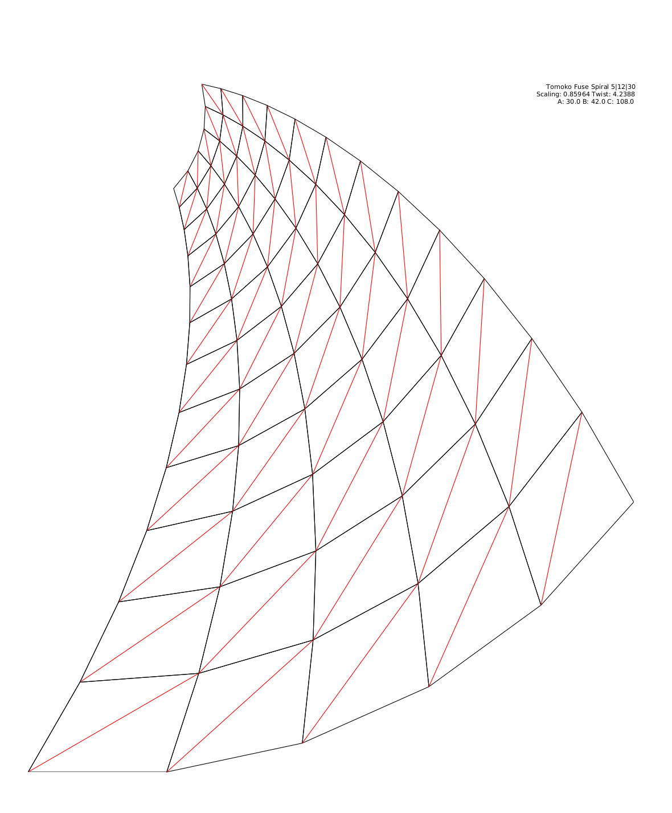

# Spirals
A python script that can be used to make crease patterns for Tomoko Fuse's spiral designs, as described in [Spiral: Origami | Art | Design](https://viereck-verlag.de/en/produkt/spiral-origami-art-design/).

Also intended as a simple demonstration of git/github.
 
Requirements:
- matplotlib
- numpy

Here's what one of the crease patterns looks like

